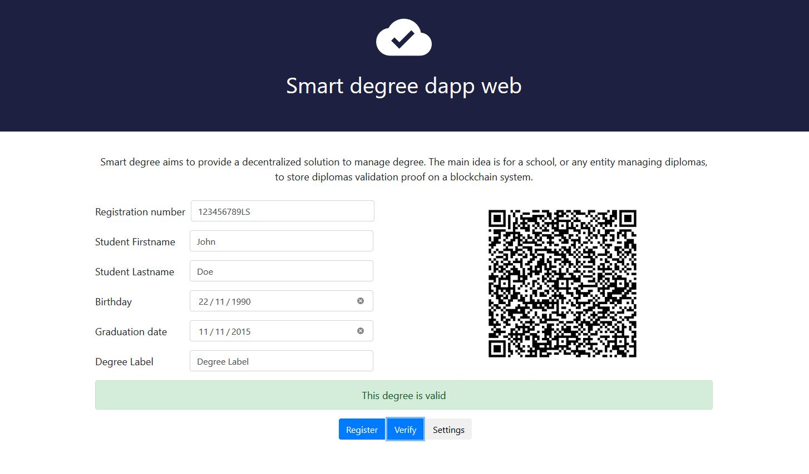

# Smart Degree

Smart degree aims to provide a decentralized solution to manage degree. The main idea is for a school, or any entity managing diplomas, to store diplomas validation proof on a blockchain system. Smart Degree currently uses Ethereum as backing blockchain. Once a degree is committed on the blockchain, anyone is able to verify if a degree has been validated by the entity. For example, an employer can verify qualification of a candidate during a job interview.

## Getting Started

Smart degree repository contains :

* decentralized web application to interact with the smart contract

### Installing

Download dependencies

```
npm install
```


## Running the decentralized web application

```
npm start
```

Then visit :  http://localhost:3000/



Adbelhamid Bakhta

Karim Taam

Ludovic Maréchal

## License
